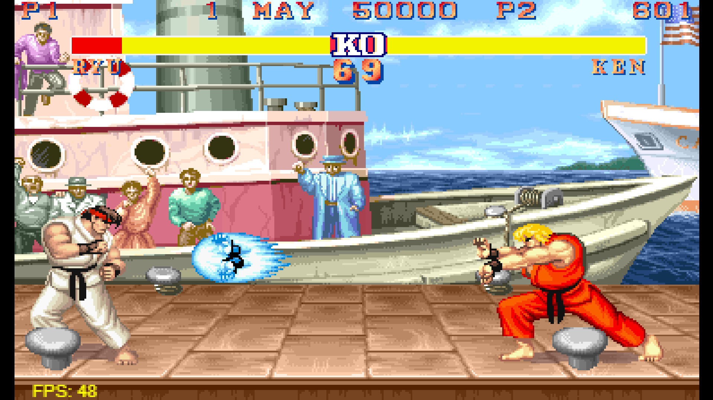
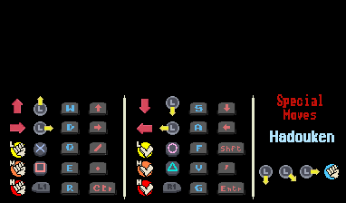

# Street Fighter

You can access the hosted version of the Street Fighter game by following this link: [Street Fighter Game](https://streetfighterbymayank.netlify.app/)

This hosted version allows you to play the game directly in your web browser without the need for any downloads or installations. Experience the excitement of classic arcade-style fighting gameplay right from your device!



## Project Overview

This project is a simple Street Fighter game implemented using JavaScript and HTML5 canvas. It features classic characters like Ryu and Ken, along with various sound effects and stages.

## Game Controls

The game controls are as follows:



### Player 1:

- **Movement**:

  - Keyboard: Arrow keys (Left, Right, Up, Down)
  - Gamepad: Left thumbstick

- **Attacks**:
  - Light Punch: Q (Keyboard) / X (Gamepad)
  - Medium Punch: E (Keyboard) / Square (Gamepad)
  - Heavy Punch: R (Keyboard) / L1 (Gamepad)
  - Light Kick: F (Keyboard) / O (Gamepad)
  - Medium Kick: V (Keyboard) / Triangle (Gamepad)
  - Heavy Kick: G (Keyboard) / R1 (Gamepad)

### Player 2:

- **Movement**:

  - Keyboard: WASD keys (W for Up)
  - Gamepad: Left thumbstick

- **Attacks**:
  - Light Punch: Slash (Keyboard) / X (Gamepad)
  - Medium Punch: ControlRight (Keyboard) / Square (Gamepad)
  - Heavy Punch: Period (Keyboard) / L1 (Gamepad)
  - Light Kick: ShiftRight (Keyboard) / O (Gamepad)
  - Medium Kick: Quote (Keyboard) / Triangle (Gamepad)
  - Heavy Kick: Enter (Keyboard) / R1 (Gamepad)

Please note that for gamepad controls, the controller left thumbstick also works as movement input.

## Getting Started

To get started with the project, follow these steps:

1. Clone the repository:
   ```
   git clone https://github.com/Mayank-Jain-1/StreetFighter
   ```
2. Open `index.html` in your preferred web browser.

That's it! You should now be able to play the Street Fighter game in your browser.

---

## Understanding Game Logic

1. ### BattleScene.js

The `BattleScene.js` file contains the implementation of the `BattleScene` class, which represents the scene where the battle between fighters takes place in the game. This class handles various aspects of the battle scene, including fighter management, camera control, animation, and game state.

#### Overview

- **Fighter Management**: Manages the initialization, update, and rendering of fighter entities in the battle scene. It handles player input, fighter interactions, and state transitions during battles.

- **Camera Control**: Controls the camera movement and focus within the battle scene to ensure that both fighters remain within view during gameplay. It provides smooth camera transitions and follows the fighters' movements.

- **Animation and Effects**: Handles fighter animations, hit effects, and other visual elements such as shadows and overlays to provide a dynamic and engaging battle experience for players.

- **Game State Management**: Manages the overall game state, including fighter hit points, victory conditions, and transitions between scenes such as the start scene and end scene.

#### Key Components

- **Fighter Entities**: Initializes and manages fighter entities based on player selection and game state. It handles fighter animations, attacks, collisions, and interactions with the environment.

- **Camera**: Controls the camera position and movement to keep both fighters in view during battles. It allows smooth tracking of fighter movements and provides a dynamic viewing experience.

- **Hit Effects**: Manages hit effects such as splashes and screen shake to provide visual feedback when fighters land attacks or take damage during battles.

- **Game State**: Tracks the game state, including fighter hit points, victory conditions, and scene transitions. It ensures consistent gameplay logic and progression throughout the battle scene.

#### Usage

To use the `BattleScene` class in your game:

1. Import the `BattleScene` class from the `BattleScene.js` file.
2. Initialize an instance of the `BattleScene` class within your game's scene management system.
3. Integrate player input handling to control fighter actions and movements during battles.
4. Implement collision detection and hit detection to determine the outcome of attacks and interactions between fighters.
5. Customize the battle scene's visual effects, camera behavior, and game state management to fit your game's specific requirements and mechanics.

#### Example

```javascript
import { BattleScene } from './BattleScene.js';

// Initialize the battle scene
const battleScene = new BattleScene(changeScene);

// Main game loop
function gameLoop() {
	// Update the battle scene
	battleScene.update(time);

	// Draw the battle scene
	battleScene.draw(context);
}
```

#### Notes

- Ensure that the `BattleScene` class is properly integrated into your game's scene management system and updated/rendered within the main game loop.
- Customize the `BattleScene` class as needed to add new features, optimize performance, and enhance the overall gameplay experience.
- Refer to the comments and documentation within the `BattleScene.js` file for detailed explanations of class methods, properties, and usage guidelines.

---

2. ### Fighter.js

This file contains the implementation of the `Fighter` class, which represents a fighter character in the game. The class handles various aspects of the fighter's behavior, including movement, attacks, collisions, animations, and state transitions.

#### Overview

- **Input Handling**: The fighter class listens for player input using an input handler and responds accordingly to trigger different actions such as movement, jumping, crouching, and attacking.

- **Animation**: It manages the fighter's animations, including transitioning between different animation states such as idle, walking, jumping, and attacking. Animation frames are handled based on predefined timings and states.

- **Collision Detection**: The fighter class detects collisions with the opponent fighter to determine whether attacks land successfully or whether fighters collide during movement.

- **State Management**: It maintains the state of the fighter, which determines its current behavior and actions. States include idle, walking, jumping, crouching, and various attack states with different attack strengths.

- **Sound Effects**: The class handles playing sound effects for attacks, hits, and landing actions to provide audio feedback during gameplay.

#### Key Components

- **Velocity and Position**: Tracks the fighter's velocity and position in the game world, allowing smooth movement and interaction with the environment and other fighters.

- **Animation Handling**: Manages animation frames and timing, ensuring smooth transitions between different animation states and providing visual feedback to players.

- **Attack Detection**: Detects successful attacks on the opponent fighter based on collision detection and triggers appropriate hit effects and damage calculations.

- **State Transitions**: Handles transitions between different states based on player input, game events, and predefined conditions, ensuring responsive and dynamic fighter behavior.

- **Collision Detection**: Detects collisions between fighters and the environment, including stage boundaries and other game objects, to prevent clipping and ensure fair gameplay.

#### Usage

To use the `Fighter` class in your game:

1. Import the `Fighter` class from the `Fighter.js` file.
2. Initialize instances of the `Fighter` class for each player character in your game.
3. Implement input handling to control the fighters' actions, such as movement and attacks.
4. Integrate collision detection to determine the outcome of attacks and interactions between fighters.
5. Manage animations and state transitions to provide visual feedback and create engaging gameplay experiences.

#### Example

```javascript
import { Fighter } from './Fighter.js';

// Initialize player 1 fighter
const player1Fighter = new Fighter(player1Id, onAttackHit, entityList);

// Initialize player 2 fighter
const player2Fighter = new Fighter(player2Id, onAttackHit, entityList);

// Main game loop
function gameLoop() {
	// Update player 1 fighter
	player1Fighter.update(time, camera);

	// Update player 2 fighter
	player2Fighter.update(time, camera);

	// Render fighters
	player1Fighter.draw(context, camera);
	player2Fighter.draw(context, camera);
}
```

#### Notes

- Ensure that the `Fighter` class is instantiated and updated within your game loop to maintain proper functionality and synchronization with the game state.
- Customize the `Fighter` class as needed to fit the specific requirements and mechanics of your game, including adding new states, actions, and animations.

For more details on the implementation and usage of the `Fighter` class, refer to the comments and documentation within the `Fighter.js` file.

---

3. ### ControlHistory.js

The `ControlHistory.js` file implements the `ControlHistory` class, which manages the history of player controls during gameplay. It tracks the sequence of button inputs and moves made by the player and provides functionality to detect special moves based on predefined sequences.

#### Overview

- **Control Tracking**: Tracks the history of player controls, including button inputs and directional movements, to detect special move sequences during gameplay.

- **Button Mapping**: Maps player controls to specific button inputs and directional movements defined in the game's configuration settings.

- **Special Move Detection**: Detects special moves performed by the player based on predefined sequences of button inputs and directional movements. It triggers state changes for fighters when special moves are successfully executed.

#### Key Components

- **History Management**: Manages the history of player controls as an array of control events, including button presses and directional movements. It handles additions and removals from the history based on time constraints and polling intervals.

- **Button Mapping**: Maps control functions to specific button inputs and directional movements defined in the game's configuration settings. It provides a flexible mechanism for associating player controls with in-game actions.

- **Special Move Detection**: Detects special move sequences performed by the player by matching the current control history against predefined sequences associated with each special move. It triggers state changes for fighters when valid move sequences are detected.

#### Usage

To use the `ControlHistory` class in your game:

1. Import the `ControlHistory` class from the `ControlHistory.js` file.
2. Initialize an instance of the `ControlHistory` class for each player character in your game.
3. Integrate control handling to capture player input and update the control history during gameplay.
4. Implement special move detection logic to check for valid move sequences and trigger state changes for fighters accordingly.

#### Example

```javascript
import { ControlHistory } from './ControlHistory.js';

// Initialize control history for a fighter
const controlHistory = new ControlHistory(fighter);

// Main game loop
function gameLoop() {
	// Update control history
	controlHistory.update(time);
}
```

---

4. ### Camera.js

The `Camera.js` file implements the `Camera` class, which represents the viewport camera used to control the visible area of the game scene. It dynamically adjusts its position based on the movement and positions of the fighters to ensure that they remain in view during gameplay.

#### Overview

- **Viewport Control**: Manages the position of the camera within the game scene to control the visible area displayed to the player. It adjusts its position based on the movement and positions of the fighters to keep them within view.

- **Scrolling Behavior**: Implements scrolling behavior to follow the fighters horizontally and vertically as they move within the game stage. It ensures that the camera smoothly tracks the fighters' movements while preventing them from moving out of view.

#### Key Components

- **Position Management**: Tracks the position of the camera within the game scene using x and y coordinates. It updates its position dynamically based on the movement and positions of the fighters to keep them centered within the viewport.

- **Scrolling Logic**: Implements scrolling logic to adjust the camera's position horizontally and vertically based on the fighters' movements. It ensures that the camera follows the fighters smoothly while maintaining a suitable view of the game scene.

- **Boundary Constraints**: Enforces boundary constraints to prevent the camera from moving beyond the edges of the game stage. It ensures that the camera stays within the bounds of the stage to maintain a coherent view of the gameplay area.

#### Usage

To use the `Camera` class in your game:

1. Import the `Camera` class from the `Camera.js` file.
2. Initialize an instance of the `Camera` class with initial x and y coordinates and a reference to the fighters array.
3. Integrate camera updating logic within your game loop to ensure that the camera's position is updated dynamically based on the fighters' movements.

#### Example

```javascript
import { Camera } from './Camera.js';

// Initialize camera with initial position and fighters array
const camera = new Camera(initialX, initialY, fighters);

// Main game loop
function gameLoop() {
	// Update camera position
	camera.update(time, context);
}
```

#### Notes

- Customize the `Camera` class as needed to support additional features such as zooming, camera effects, and dynamic viewport resizing.
- Ensure that the camera updating logic is executed within the main game loop to maintain real-time synchronization with the game state and player actions.
- Refer to the comments and documentation within the `Camera.js` file for detailed explanations of class methods, properties, and usage guidelines.

#### Notes

- Customize the `ControlHistory` class as needed to support additional control mappings, special move sequences, and gameplay mechanics specific to your game.
- Ensure that the control history is updated within the main game loop to maintain accurate tracking of player input and enable real-time detection of special moves.
- Refer to the comments and documentation within the `ControlHistory.js` file for detailed explanations of class methods, properties, and usage guidelines.

## Resources Used for Game Development

During the development of the game, the following websites and applications were utilized for creating and editing sprites, as well as obtaining sounds:

1. **GraphicsGale**:

   - **Description**: GraphicsGale is a versatile graphics editor primarily used for creating and editing sprites, animations, and pixel art.
   - **Usage**: GraphicsGale was used extensively throughout the development process for designing and refining sprite graphics, including character animations, backgrounds, and visual effects.

2. **The Spriters Resource** (https://www.spriters-resource.com/):

   - **Description**: The Spriters Resource is an online repository of sprite sheets, game graphics, and artwork sourced from various video games across different platforms.
   - **Usage**: The Spriters Resource served as a valuable resource for obtaining sprite sheets and game graphics to use in the game development process. It provided a wide range of sprites for characters, objects, and environments, which were incorporated into the game with appropriate modifications.

3. **The Sounds Resource** (https://www.sounds-resource.com/):
   - **Description**: The Sounds Resource is an online platform offering a vast collection of video game sounds, music tracks, and audio clips extracted from numerous video games.
   - **Usage**: The Sounds Resource was utilized to acquire sound effects, background music, and other audio assets to enhance the auditory experience of the game. It provided access to a diverse selection of sounds suitable for various in-game actions, events, and interactions.

By leveraging these resources, the game development process was enriched with high-quality graphics and audio elements, contributing to the overall immersion and enjoyment of the gaming experience.

## Contributing

If you would like to contribute to the project, feel free to open an issue or submit a pull request. Any contributions are welcome!

## License

This project is licensed under the [MIT License](LICENSE).

---

Feel free to update this README as the project progresses!
